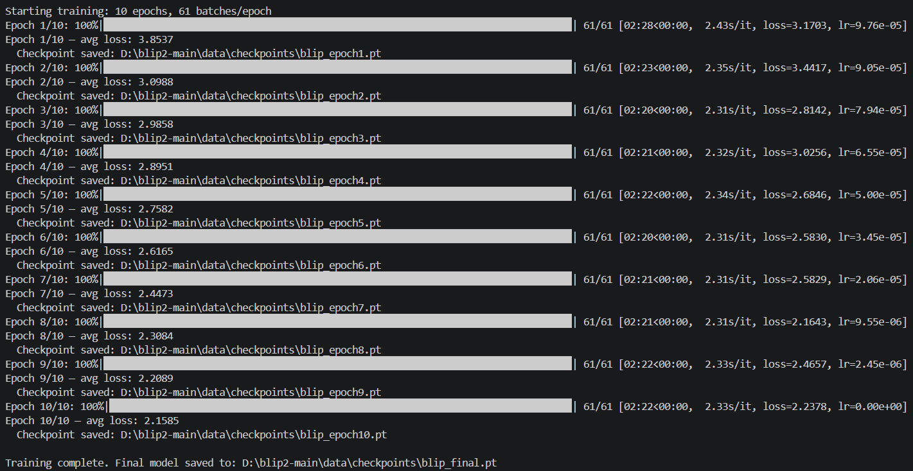
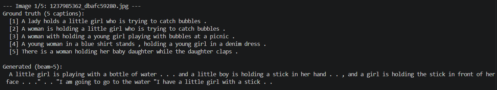
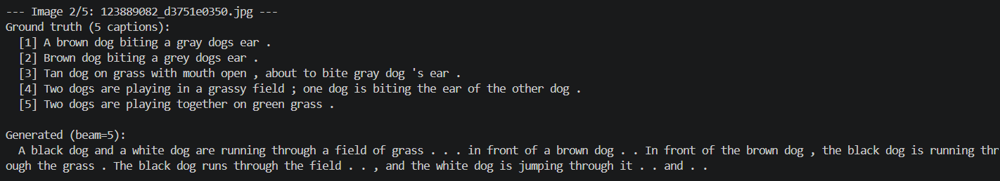
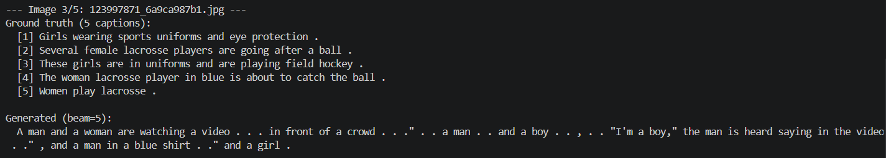
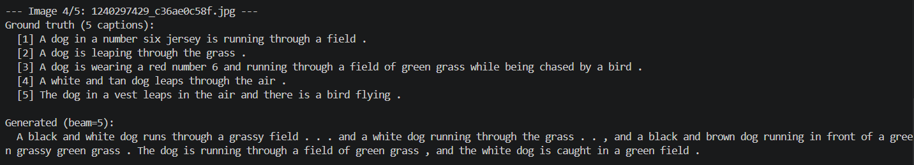
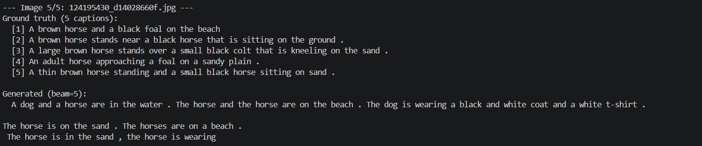
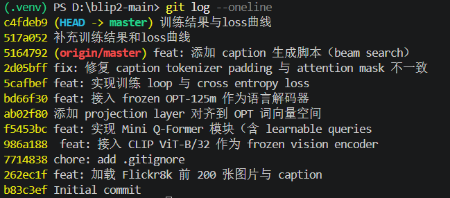

# Mini-BLIP2 图像描述生成复现实验报告

## 1. 论文信息

- 论文名称：BLIP-2: Bootstrapping Language-Image Pre-training with Frozen Image Encoders and Large Language Models
- 论文地址：https://arxiv.org/abs/2301.12597

## 2. 任务说明

本实验复现的任务是图像描述生成 Image Captioning。

输入：图片  
输出：英文 caption

## 3. 数据集

- 数据集名称：Flickr8k
- 数据集地址：https://www.kaggle.com/datasets/adityajn105/flickr8k
- 实际使用数据量：前 200 张图片

## 4. 模型结构

 Mini-BLIP2 结构：
 
```text
Image → Frozen Vision Encoder (CLIP ViT-B/32) → Mini Q-Former → LanguageProjection → Frozen Language Decoder (OPT-125m) → Caption
```

### 4.1 Vision Encoder

使用的视觉编码器：`openai/clip-vit-base-patch32`。

### 4.2 Mini Q-Former

说明自己实现的Mini Q-Former：

- query token 数量：32
- hidden size：768
- Transformer 层数：2
- 是否使用 cross-attention：是

### 4.3 Language Decoder

使用的语言解码器：`facebook/opt-125m`。

## 5. 训练设置

请填写：

- 训练数据量：Flickr8k前200张图片（其中5张作为测试集）
- epoch：10
- batch size：16
- learning rate：1e-4
- optimizer：AdamW（weight_decay=0.01）
- loss function：cross entropy loss
- 冻结的模块：Vision Encoder + Language Decoder
- 训练的模块：Mini Q-Former + Projection Layer

## 6. 训练过程

粘贴训练日志或 loss 变化截图。



## 7. 生成结果展示







## 8. 总结

请简要说明：

- 是否成功跑通训练；
- 生成效果如何；
- 遇到了什么问题；
- 如果继续改进，可以怎么做。

```text
成功跑通训练，生成效果处于初步阶段，能够识别出物体、颜色、场景等信息，但是语言缺少流畅度，存在标点重复出现、细节不够准确、没有学会句子结束信号重复生成导致句子过长等问题。
复现过程中，遇到了SSL证书验证失败、OPT模型无 pad_token等问题。
后续可以通过增加训练数据、增加训练轮数、增大batch size、使用层数更大的q-former模块、采用两阶段训练来改进模型
```

## 9. AI 对话过程记录

请填写本次复现过程中与 AI 工具的对话记录（对应 requirements.md 第 9.1 节）。

- 录制工具：claude code 自带的记录
- 对话链接：仓库内“Claude会话”文件
- 使用的 AI 模型：DeepSeek V4Pro 
- 累计对话时长 / 会话数：对话时长约3-5h，会话数2

简要说明 AI 在哪些环节给了帮助、哪些地方是自己独立完成或推翻了 AI 的建议（2—4 句话即可）：

```text
AI可以指导我的代码结构，通过我给出的模型架构提示词实现各模块的代码，在设计新模块时会及时告知我前面模块需要修改的地方
我自己可以根据本地数据路径和文件结构编写具体代码，能够设计q-former各类参数并验证通过，ai建议每2个epoch保存结果，因为我的epoch只有10，所以我改为每个epoch都保存结果
```

## 10. Git 提交记录

请填写本次复现的代码仓库与提交历史（对应 requirements.md 第 9.2 节）。

- 仓库地址：https://github.com/shadow537/blip2-project
- 总 commit 数：12

粘贴 `git log --oneline` 输出（或截图）：



